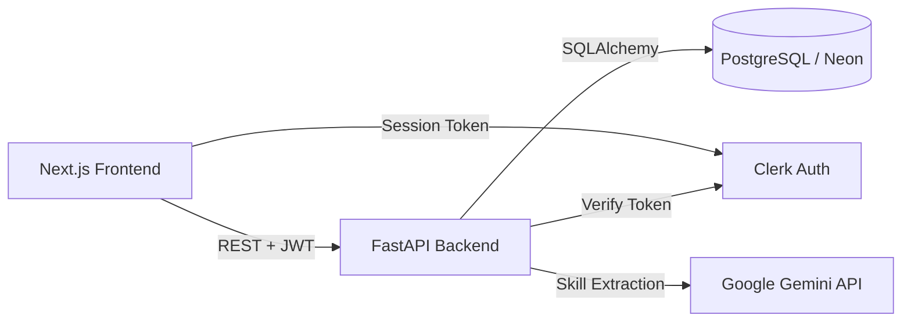

# Career Copilot

A full-stack, AI-powered career readiness platform that matches a student's actual resume against real hackathon and internship opportunities — surfacing exactly which skills to build next, not just generic advice.


## Why this exists

Most "AI career advice" tools generate a one-time, generic roadmap. Career Copilot instead does live, resume-grounded gap analysis: upload a resume, and get back a ranked list of real opportunities, each showing exactly which required skills you already have and which you're missing — closing the gap between "what should I learn" and "why."

## Features

- **Resume upload & AI skill extraction** — parses PDF/DOCX resumes and extracts a clean, structured skill list using Google's Gemini API
- **Live opportunity matching** — computes a match score between a resume and a database of hackathons/internships, using real skill-overlap logic (not just keyword search)
- **Gap analysis** — for each opportunity, shows exactly which skills you have and which you're missing, ranked by fit
- **Authentication** — full user accounts via Clerk, with backend-verified sessions (JWT-based), so each user's resumes are private and isolated
- **Persistent storage** — PostgreSQL (hosted on Neon) backs all resume and opportunity data


## Tech stack

| Layer | Technology |
|---|---|
| Frontend | Next.js, TypeScript, Tailwind CSS |
| Backend | FastAPI (Python) |
| Database | PostgreSQL (Neon) via SQLAlchemy |
| AI | Google Gemini API (skill extraction) |
| Auth | Clerk (frontend SDK + backend JWT verification) |

## Architecture



**Request flow example (resume upload):**
1. User uploads a resume via the Next.js frontend
2. Frontend attaches the user's Clerk session token and sends the file to FastAPI
3. FastAPI verifies the token, extracts raw text from the PDF/DOCX, and sends it to Gemini for structured skill extraction
4. Extracted skills are saved to PostgreSQL, scoped to that user
5. A second request computes gap analysis by comparing the saved skills against all seeded opportunities
6. Results are returned and rendered as ranked, color-coded opportunity cards


## Running locally

**Backend:**
```bash
cd backend
python -m venv venv
venv\Scripts\activate  # Windows
pip install -r requirements.txt
uvicorn app.main:app --reload
```

**Frontend:**
```bash
cd frontend
npm install
npm run dev
```

Both need their own `.env` / `.env.local` files with database, Gemini, and Clerk credentials (see `.env.example` — not committed for security).

## Current status & roadmap

This is a working prototype with seeded opportunity data (real hackathons/internships collected manually), demonstrating the full pipeline end-to-end. Planned next steps:
- Live data ingestion from hackathon/internship platforms via scheduled scraping
- Expanded opportunity sources beyond the current seed set
- Production deployment with live Clerk keys


## What I learned building this

Real debugging experience across the stack: stale database connections under Neon's idle timeout (fixed via SQLAlchemy connection pre-pinging), breaking API changes in both Clerk (Core 3 component migration) and Gemini (model deprecation), and CORS/auth configuration across a multi-service deployment (Vercel + Railway + Neon).
